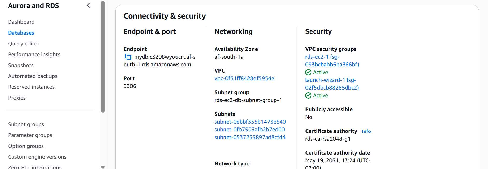
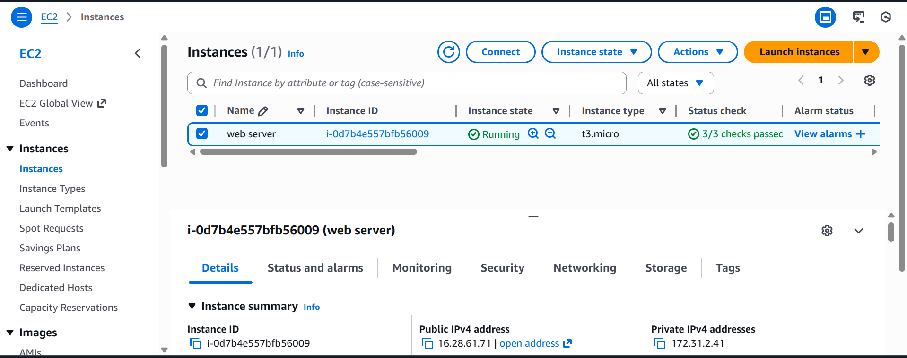
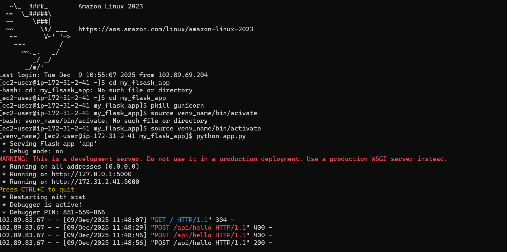
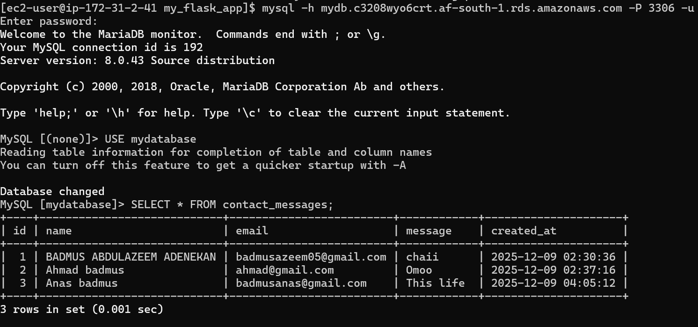
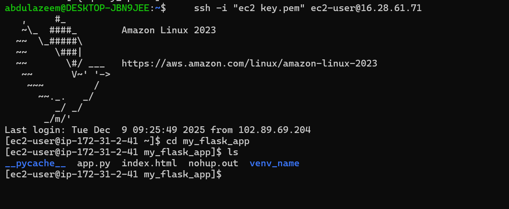

# flask-ec2-rds-deployment
# Full-Stack Deployment on AWS EC2 — Flask Backend & RDS Database

## Table of Contents

* [Project Overview](#project-overview)
* [Architecture](#architecture)
* [Features](#features)
* [Technologies Used](#technologies-used)
* [Folder Structure](#folder-structure)
* [Backend Setup](#backend-setup)
* [Frontend Setup](#frontend-setup)
* [Database Setup (AWS RDS)](#database-setup-aws-rds)
* [API Endpoints](#api-endpoints)
* [Security Measures](#security-measures)
* [Testing](#testing)
* [Challenges & Fixes](#challenges--fixes)
* [Future Improvements](#future-improvements)
* [Screenshots](#screenshots)

---

## Project Overview

This project is a fully deployed end-to-end web application hosted on AWS, demonstrating a Flask backend, a static HTML frontend, and an AWS RDS SQL database, all running on an Amazon Linux EC2 instance. It showcases cloud deployment, backend development, database integration, and production-level configuration using Gunicorn and Flask-CORS.

## Architecture

The application flow is:

```
Client Browser → EC2 Instance (Flask + Gunicorn) → AWS RDS (MariaDB)

```


**Database:** AWS RDS (MariaDB/MySQL), MariaDB client on EC2

**Cloud Infrastructure:** Amazon EC2, AWS RDS, Security Groups, Amazon Linux

**Tools:** Git, venv, bash, systemctl

## Folder Structure

```
my_flask_app/
│
├─ app.py                 # Main Flask application
├─ index.html             # Frontend HTML file
├─ venv/                  # Python virtual environment
└─ README.md              # Project documentation
```

## Backend Setup

1. Activate virtual environment:

```bash
source venv/bin/activate
```

2. Install dependencies:

```bash
pip install flask flask-cors gunicorn pymysql
```

3. Run in development mode:

```bash
python3 app.py
```

4. Run in production mode (Gunicorn):

```bash
gunicorn --bind 0.0.0.0:5000 app:app
```

## Frontend Setup

* Open `index.html` in browser
* Form submissions interact with backend API using fetch()

## Database Setup (AWS RDS)

* Use AWS RDS (MySQL-compatible) for database
* MariaDB client installed on EC2 for administration

```bash
sudo yum install mariadb105
mysql -h mydb.c3208wyo6crt.af-south-1.rds.amazonaws.com -u admin -p
```

* Example schema:

```sql
CREATE DATABASE mydb;
USE mydatabase;
CREATE TABLE contact_messages (
    id INT AUTO_INCREMENT PRIMARY KEY,
    name VARCHAR(255) NOT NULL,
    email VARCHAR(255) NOT NULL,
    message TEXT NOT NULL,
    created_at TIMESTAMP DEFAULT CURRENT_TIMESTAMP
);

```

## API Endpoints

| Method | Endpoint        | Description               |
| ------ | --------------- | ------------------------- |
| GET    | `/`             | Returns homepage string   |
| GET    | `/api/hello`    | Sample API endpoint       |
| POST   | `/api/save`     | Saves data to RDS         |


Actual endpoints:

* [http://16.28.61.71/](http://16.28.61.71/)
* [http://16.28.61.71:5000/api/hello](http://16.28.61.71:5000/api/hello)

## Security Measures

* Security groups configured to allow port 5000 and limit database access
* Environment variables used for credentials
* Gunicorn used instead of Flask dev server
* EC2 instance runs Amazon Linux with virtual environment

## Testing

* Test backend:

```bash
curl http://16.28.61.71:5000/api/hello
```

* Test database:

```sql
SELECT * FROM messages;
```

* Test frontend form submission by opening the webpage

## Challenges & Fixes

| Issue                        | Cause                         | Fix                        |
| ---------------------------- | ----------------------------- | -------------------------- |
| Flask not reachable publicly | Bind was 127.0.0.1            | Changed to 0.0.0.0         |
| CORS errors                  | Browser blocked requests      | Added Flask-CORS           |
| App crashed on logout        | Flask dev server stops        | Used Gunicorn              |
| EC2 couldn’t connect to RDS  | Security group not configured | Whitelisted EC2 private IP |

## Future Improvements

* Add HTTPS using AWS Certificate Manager or CloudFront
* Set up CI/CD deployment pipeline
* Containerize using Docker
* Add authentication and logging

## Screenshots
The screenshots below illustrate the application and database interactions:










